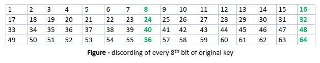

# Thuật toán DES
## 1. Khái niệm
- DES là 1 thuật toán **mã hóa khối** và mã hóa dữ liệu trong khối có kích thước 64 bit(64 bit plain text --> 64 bit ciphertext)
- Khi mã hóa và giải mã sử dụng chung **1 thuật toán và khóa**, khóa ở dây có độ dài là **56 bit** 
## 2. Ý tưởng
A, Như đề cập rằng DES sử dụng khóa **56 bit**. Trên thực tế, khóa ban đầu bao gồm 64 bit. Tuy nhiên, trước khi quá trình DES bắt đầu, mỗi bit thứ 8 của khóa sẽ bị loại bỏ để tạo ra khóa 56 bit. Đó là các vị trí bit 8, 16, 24, 32, 40, 48, 56 và 64 bị loại bỏ.



Như vậy, việc loại bỏ mỗi bit thứ 8 của khóa sẽ tạo ra khóa **56 bit** từ khóa **64 bit** ban đầu.

B, DES được thực hiện **16 vòng**, mỗi vòng sẽ có những bước **thay thế**(substitution) và **hoán vị**(transposition) tương ứng 

## 3. Mã hóa
**Bước 1: Sinh khóa con**

```python
key = "AABB09182736CCDD"
# Key generation

# Chuyển đổi khóa từ hex sang nhị phân
key = hex2bin(key)

# Khởi tạo bảng các hoán vị và bảng số lần dịch chuyển bit:
# Bảng hoán vị và bảng số lần dịch chuyển bit
initial_perm = [58, 50, 42, 34, 26, 18, 10, 2, ...]  # Bảng hoán vị ban đầu
shift_table = [1, 1, 2, 2, 2, 2, 2, 2, 1, 2, 2, 2, 2, 2, 2, 1]  # Bảng số lần dịch chuyển bit
key_comp = [14, 17, 11, 24, 1, 5, ...]  # Bảng hoán vị cho việc tạo khóa con

# Tạo khóa con từ khóa gốc
# Chuyển đổi khóa gốc thành 56 bit và tạo khóa con
key = permute(key, keyp, 56)
rkb = []  # Danh sách khóa con ở dạng nhị phân
rk = []   # Danh sách khóa con ở dạng hex
for i in range(0, 16):
    # Thực hiện vòng lặp để tạo khóa con
    left = shift_left(left, shift_table[i])
    right = shift_left(right, shift_table[i])
    round_key = permute(combine_str, key_comp, 48)
    rkb.append(round_key)
    rk.append(bin2hex(round_key))

#Giải mã (Decryption) - Sắp xếp ngược lại các khóa con:
# Sắp xếp ngược lại các khóa con cho quá trình giải mã
rkb_rev = rkb[::-1]
rk_rev = rk[::-1]
```
**Bước 2: Sử dụng phép hoán vị IP (Initial Permutation)**
Kết quả của phép hoán vị sẽ là 1 dãy bit mới

```python
# Table of Position of 64 bits at initial level: Initial Permutation Table
initial_perm = [58, 50, 42, 34, 26, 18, 10, 2,
                60, 52, 44, 36, 28, 20, 12, 4,
                62, 54, 46, 38, 30, 22, 14, 6,
                64, 56, 48, 40, 32, 24, 16, 8,
                57, 49, 41, 33, 25, 17, 9, 1,
                59, 51, 43, 35, 27, 19, 11, 3,
                61, 53, 45, 37, 29, 21, 13, 5,
                63, 55, 47, 39, 31, 23, 15, 7]

# Thực hiện hoán vị khởi đầu (Initial Permutation)
pt = permute(pt, initial_perm, 64)

print("After initial permutation", bin2hex(pt))
```

***Bước 3: Thực hiện các vòng mã hóa**

Sau khi hoán vị ban đầu (Initial Permutation), plaintext **(pt)** được chia thành hai nửa: `left` và `right`, mỗi nửa có kích thước 32 bit.

Trong mỗi vòng mã hóa (16 vòng), nửa phải `(right)` của plaintext được mở rộng từ 32 bit lên thành 48 bit bằng cách sử dụng phép hoán vị mở rộng (Expansion D-box - **`exp_d`**).

Sau đó, nửa phải mở rộng (**`right_expanded`**) được XOR với khóa con của vòng mã hóa hiện tại (**`rkb[i]`**).

Tiếp theo, một loạt các phép hoán vị và hoán vị `S-box` được thực hiện trên nửa phải đã `XOR` với khóa. Điều này bao gồm việc tính toán các hàng và cột để chọn giá trị từ bảng `S-box` và sau đó thực hiện hoán vị `S-box` (S-box permutation) theo bảng **per**.
Tiếp theo, nửa trái (**left**) của plaintext được XOR với kết quả từ bước trước đó (nửa phải sau khi qua S-box và hoán vị).
Tiếp theo, nửa trái (**left**) và nửa phải (**right**) được hoán đổi cho nhau (trừ vòng mã hóa cuối cùng).

Sau khi hoàn thành 16 vòng mã hóa, nửa trái và nửa phải của khối văn bản được kết hợp để tạo ra khối văn bản mã hóa.

Cuối cùng, khối văn bản mã hóa được áp dụng hoán vị cuối cùng (Final Permutation) bằng cách sử dụng bảng hoán vị **final_perm** để tạo ra văn bản mã hóa cuối cùng, và nó được trả về từ hàm.


```python
	# Splitting
	left = pt[0:32]
	right = pt[32:64]
	for i in range(0, 16):
		# Expansion D-box: Expanding the 32 bits data into 48 bits
		right_expanded = permute(right, exp_d, 48)

		# XOR RoundKey[i] and right_expanded
		xor_x = xor(right_expanded, rkb[i])

		# S-boxex: substituting the value from s-box table by calculating row and column
		sbox_str = ""
		for j in range(0, 8):
			row = bin2dec(int(xor_x[j * 6] + xor_x[j * 6 + 5]))
			col = bin2dec(
				int(xor_x[j * 6 + 1] + xor_x[j * 6 + 2] + xor_x[j * 6 + 3] + xor_x[j * 6 + 4]))
			val = sbox[j][row][col]
			sbox_str = sbox_str + dec2bin(val)

		# Straight D-box: After substituting rearranging the bits
		sbox_str = permute(sbox_str, per, 32)

		# XOR left and sbox_str
		result = xor(left, sbox_str)
		left = result
```

## 4. Giaỉ mã

Qúa trình giải mã làm ngược lại với quá trình mã hóa.

Đầu tiên, danh sách **rkb** (khóa con của các vòng mã hóa) và **rk** (khóa con dưới dạng hexa) được đảo ngược (reverse) để sử dụng các khóa con từ vòng mã hóa cuối cùng đến vòng mã hóa đầu tiên. Điều này là cần thiết vì trong quá trình giải mã, chúng ta cần sử dụng các khóa con theo thứ tự ngược lại.

Khối văn bản mã hóa (cipher_text) được truyền vào hàm **encrypt** để thực hiện quá trình giải mã. Khi đó, hàm **encrypt** sẽ thực hiện các bước giải mã DES ngược lại với quá trình mã hóa:

a. Khối văn bản mã hóa ban đầu sẽ được áp dụng hoán vị ban đầu ngược (Initial Permutation) bằng cách sử dụng bảng hoán vị **initial_perm**.

b. Tiếp theo, khối văn bản ban đầu sau hoán vị ban đầu sẽ được chia thành hai nửa, tương tự như trong quá trình mã hóa.

c. Quá trình giải mã DES gồm 16 vòng lặp, và mỗi vòng giải mã sẽ ngược lại với quá trình mã hóa. Cụ thể:

Nửa phải (**right**) sẽ được mở rộng và XOR với khóa con tương ứng từ cuối danh sách **rkb** (khóa con của vòng mã hóa cuối cùng) đến đầu danh sách **rkb**.

Sau đó, giá trị **XOR** sẽ đi qua hàm **S-box** để thu được giá trị gốc.

Nửa trái (**left**) và giá trị thu được từ **S-box** sẽ được XOR với nhau.

Nếu không phải vòng giải mã cuối cùng, nửa trái và nửa phải sẽ được hoán đổi cho nhau.

d. Sau khi hoàn thành 16 vòng giải mã, hai nửa của khối văn bản giải mã (left và right) sẽ được kết hợp lại để tạo ra khối văn bản gốc.

e. Cuối cùng, khối văn bản gốc sẽ được áp dụng hoán vị cuối cùng ngược (Final Permutation) bằng cách sử dụng bảng hoán vị final_perm. Kết quả là văn bản gốc ban đầu (**plaintext**).

Văn bản gốc (**plaintext**) sau quá trình giải mã sẽ được chuyển từ dạng nhị phân sang dạng hexa bằng hàm bin2hex, và kết quả sẽ được in ra màn hình. Điều này là văn bản ban đầu trước khi mã hóa.

```python
print("Decryption")
rkb_rev = rkb[::-1]
rk_rev = rk[::-1]
text = bin2hex(encrypt(cipher_text, rkb_rev, rk_rev))
print("Plain Text : ", text)
```